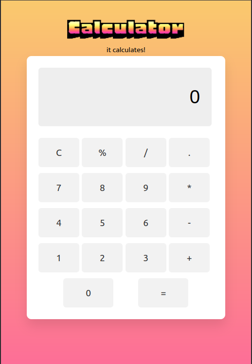

# Calculator Project

## Overview
A simple, web-based calculator that supports basic arithmetic operations. Built with HTML, CSS, and JavaScript, this project is perfect for those looking to understand the fundamentals of web development and interactive web applications.

 

## Features
-  Basic arithmetic operations: addition, subtraction, multiplication, and division
-  Clean, responsive UI that works on both desktop and mobile browsers

## Usage
To use the calculator:

-  Click on the numbers and operations on the calculator interface to input your calculation.
-  Press the "=" button to see the result displayed on the calculator screen.

## Contributing

- Contributions are welcome! If you have suggestions for improvements or bug fixes, please follow these steps:

-  Fork the repository
-  Create your feature branch (git checkout -b feature/AmazingFeature)
-  Commit your changes (git commit -m 'Add some AmazingFeature')
-  Push to the branch (git push origin feature/AmazingFeature)
-  Open a Pull Request

##  Acknowledgments
-   The amazing multi-colour font Honk Designed by Ek Type.  https://fonts.google.com/specimen/Honk
